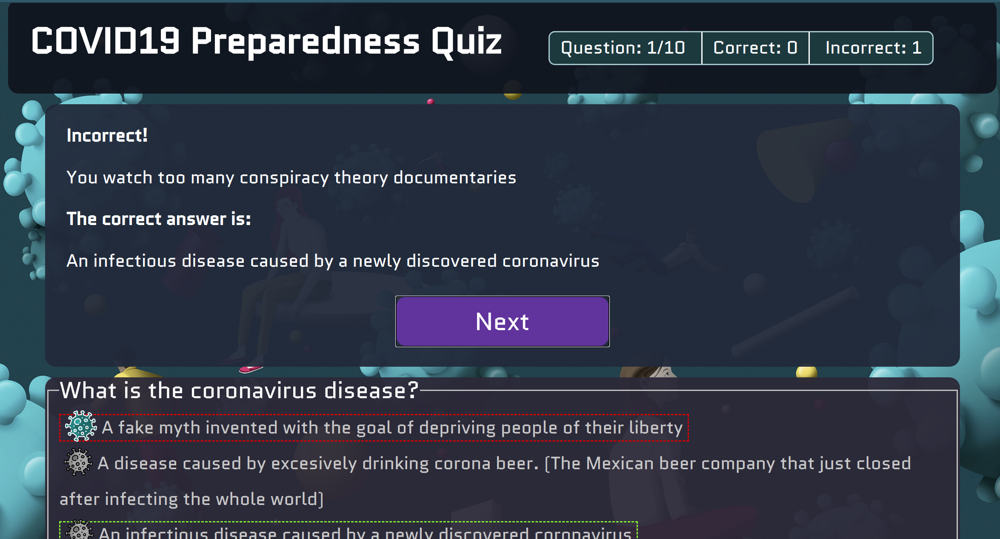

# COVID19 Preparedness Quiz

## Summary

Single-page client-side app built on Javascript, HTML and CSS that implements a multiple-choice quiz meant to test your COVID preparedness, and give you answers to important issues on the subject. 

Access it live at: https://miguelniblock.github.io/COVID19_quiz/

Questions and answers are derived from information by World Health Organization. https://www.who.int/emergencies/diseases/novel-coronavirus-2019/advice-for-public/myth-busters

## Technical Details

- Mobile-first approach, Responsive design, intuitive interface.
- Fully usable by keyboard & Ally friendly.
- Animations & transitions use custom CSS. No libraries like bootstrap.
- HTML content is injected through JQuery on('click') functions.
- User receives feedback based on their answer.

## Credits

Icons made by <a href="https://www.flaticon.com/authors/freepik" title="Freepik">Freepik</a> from <a href="https://www.flaticon.com/" title="Flaticon">www.flaticon.com</a>

**Icon sets Ideas**

- [https://www.flaticon.com/search?word=virus](https://www.flaticon.com/search?word=virus)
- [https://www.flaticon.com/packs/hygiene-and-disinfection-4](https://www.flaticon.com/packs/hygiene-and-disinfection-4)
- [https://www.flaticon.com/packs/virus-outbreak-1](https://www.flaticon.com/packs/virus-outbreak-1)

**Background image:**

[https://www.politico.com/news/magazine/2020/03/19/coronavirus-effect-economy-life-society-analysis-covid-135579](https://www.politico.com/news/magazine/2020/03/19/coronavirus-effect-economy-life-society-analysis-covid-135579)

